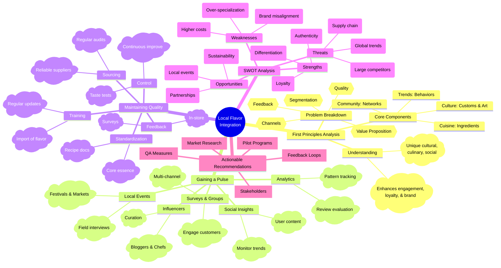

# Visual Project Plan

**Topic**: also consider the fact that we need to get a pulse of local flavor

## Brainstorm Summary
## Updated Analysis: Maintaining Consistent Quality and Flavor in Local Flavor Integration

### First Principles Analysis

1. **Understanding Local Flavor:**
   - **Definition:** Local flavor encompasses unique cultural, culinary, and social characteristics of a region.
   - **Importance:** Enhances customer engagement, fosters loyalty, and differentiates in a competitive market.

2. **Identifying Core Components:**
   - **Culture:** Traditions, festivals, art, and local customs.
   - **Cuisine:** Local dishes, ingredients, and culinary practices.
   - **Community:** Local businesses, social networks, and customer preferences.
   - **Market Trends:** Current consumer behaviors and preferences in the region.

3. **Breaking Down the Problem:**
   - **Value Proposition:** How can integrating local flavor create value for customers?
   - **Customer Segmentation:** Who are the target customers appreciating local flavor?
   - **Distribution Channels:** How will the local flavor be delivered (e.g., in-store, online, events)?
   - **Feedback Mechanism:** How will we gather insights about local preferences?
   - **Quality Consistency:** How can we ensure the quality and integrity of local offerings?

### Strategies to Get a Pulse of Local Flavor

- **Conduct Surveys and Focus Groups:**
  - Engage local customers to understand their preferences and perceptions.
  - Use both online and offline methods to reach diverse demographics.

- **Leverage Social Media Insights:**
  - Monitor local trends, discussions, and sentiments on platforms like Instagram, Facebook, and Twitter.
  - Analyze hashtags and user-generated content related to local cuisine and culture.

- **Participate in Local Events:**
  - Attend festivals, markets, and community gatherings to engage directly with locals and observe their preferences.
  - Collect feedback through informal conversations or structured interviews at these events.

- **Collaborate with Local Influencers:**
  - Partner with local bloggers, chefs, and community leaders who can provide insights and amplify your brand’s reach.
  - Utilize their knowledge to curate offerings that resonate with local tastes.

- **Utilize Analytics Tools:**
  - Employ data analysis tools to track purchasing patterns and local trends.
  - Evaluate customer reviews and feedback on existing products to identify areas for improvement.

### Strategies to Maintain Consistent Quality and Flavor

- **Standardized Sourcing Protocols:**
  - Develop relationships with reliable local suppliers who can provide consistent quality ingredients.
  - Regularly audit suppliers to ensure adherence to quality standards.

- **Training and Development:**
  - Train staff on the importance of local flavor and how to prepare dishes consistently.
  - Implement regular training sessions to keep staff updated on quality standards and local offerings.

- **Quality Control Processes:**
  - Establish a robust quality control system that includes regular taste tests and quality checks for local dishes.
  - Use customer feedback to continuously evaluate and improve the quality of local offerings.

- **Documentation and Recipe Standardization:**
  - Create standardized recipes that capture the essence of local flavor while ensuring consistency.
  - Document preparation methods and ingredient ratios to maintain flavor across different locations.

- **Customer Feedback Mechanisms:**
  - Actively seek customer feedback on local offerings to identify areas for improvement.
  - Use surveys, social media, and in-store feedback to gauge customer satisfaction with local flavors.

### SWOT Analysis

**Strengths:**
- Unique selling proposition that differentiates from competitors.
- Builds strong community relationships and customer loyalty.
- Enhances brand authenticity and trust.

**Weaknesses:**
- Potential for misalignment with broader corporate branding.
- Risk of over-specialization, limiting market reach.
- Possible higher costs associated with sourcing local ingredients or talent.

**Opportunities:**
- Growing consumer interest in local products and sustainable practices.
- Potential partnerships with local artisans and businesses.
- Ability to tap into local events and festivals for marketing.

**Threats:**
- Competition from larger brands that may replicate local offerings.
- Economic fluctuations affecting local supply chains.
- Changing consumer preferences towards global or convenience products.

### Actionable Recommendations
- **Conduct Market Research:** Use surveys and focus groups to gather data on local preferences.
- **Engage Local Stakeholders:** Build partnerships with local businesses and influencers to enhance authenticity.
- **Pilot Programs:** Test local flavor offerings in select markets before full-scale implementation.
- **Establish Feedback Loops:** Utilize customer feedback to continuously adapt and refine offerings.
- **Implement Quality Assurance Measures:** Develop sourcing protocols, train staff, and utilize quality control processes to maintain consistency.

By incorporating these strategies, you can effectively gauge local flavor, maintain quality, and integrate it into your business strategy while minimizing risks and maximizing opportunities.

## Architecture / Flow Diagram
